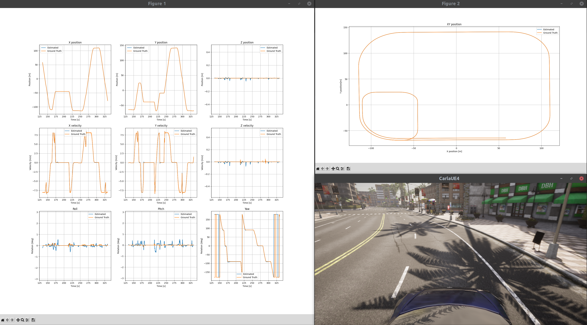

# State estimation using Kalman filter

This repository showcases the application of Error-State Extended Kalman Filter (ES-EKF) for state estimation within a self-driving car, utilizing the CARLA simulator.

This project was inspired by ["State Estimation and Localization for Self-Driving Cars"](https://www.coursera.org/learn/state-estimation-localization-self-driving-cars?specialization=self-driving-cars) from Coursera platform. Design of Kalman filter is based on the assignment from that course.

## ES-EKF

Estimated vehicle state is: position (3D), velocity (3D), orientation (4D, quaternion).

Motion model input: IMU measurements (acceleration (3D), angular velocity(3D)).

Motion model: TODO.

Measurement model input: GNSS measurement (3D, transformed to CARLA location)

Measurement model: TODO

ES-EKF outline: TODO

## Requirements

[CARLA simulator](https://carla.readthedocs.io/en/0.9.13/) - tested on version **0.9.13**

## Quick start

In the first terminal start CARLA server (optionally with `-quality-level=Low`):
```
./CarlaUE4.sh
```

In the second terminal start state estimation demo (CARLA client):
```
./run_state_estimation.py
```

Example output:


## TODO

Simulation setup:

- add measurement noises
- change sensor location relative to ego vehicle
- add LIDAR with transformation to get localization

General:

- improve README
