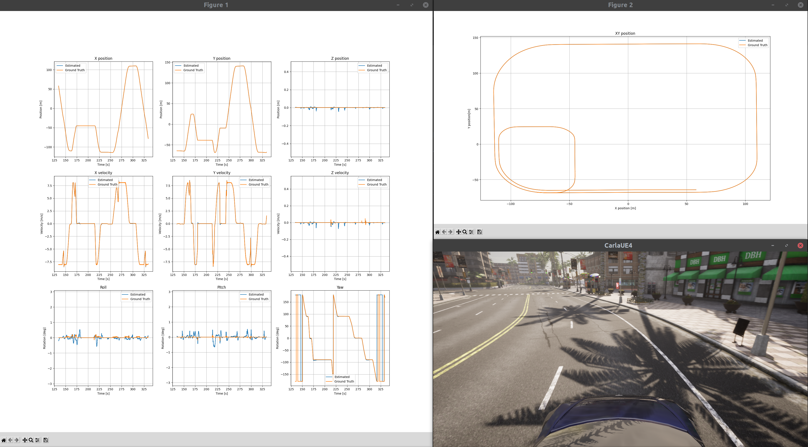

# State estimation using Kalman filter

This repository showcases the application of Error-State Extended Kalman Filter (ES-EKF) for state estimation within a self-driving car, utilizing the CARLA simulator.

This project was inspired by ["State Estimation and Localization for Self-Driving Cars"](https://www.coursera.org/learn/state-estimation-localization-self-driving-cars?specialization=self-driving-cars) from Coursera platform.

## Overview

- CARLA server is operating in synchronous mode
- CARLA client collects sensor measurements and performs state estimation before next simulation step is triggered (ticked)
- location of ego vehicle is taken from the server (world snapshot) as a reference (ground truth) for comparing state estimation results
- state estimation and ground truth values are sent to a separate plotting process

### ES-EKF Overview

Estimated vehicle state is: position (3D), velocity (3D), orientation (4D, quaternion).

Motion model input: IMU measurements (acceleration (3D), angular velocity(3D)).

Motion model: TODO.

Measurement model input: GNSS measurement (3D, transformed to CARLA location)

Measurement model: TODO

ES-EKF outline: TODO

## Dependencies

[CARLA simulator](https://carla.readthedocs.io/en/0.9.13/) - tested on version **0.9.13**

## Quick start

In the first terminal start CARLA server (optionally with `-quality-level=Low`):

```bash
./CarlaUE4.sh
```

In the second terminal start state estimation demo (CARLA client):

```bash
./run_state_estimation.py
```

Example output:


## TODO

Simulation setup:

- add measurement noises
- change sensor location relative to ego vehicle
- add LIDAR with transformation to get localization

General:

- improve README

## Acknowledgements

- Design of Kalman filter is based on the assignment from ["State Estimation and Localization for Self-Driving Cars"](https://www.coursera.org/learn/state-estimation-localization-self-driving-cars?specialization=self-driving-cars).
- Transformation of GNSS measurements from carla.GeoLocation to carla.Location is
base on Geo2Location from [carla-semantic-localization](https://github.com/lian999111/carla-semantic-localization/blob/c4844f2f6b8bbc21c8e3e4962954cf01eb673e85/carlasim/data_collect.py).
